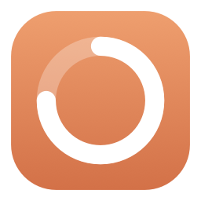
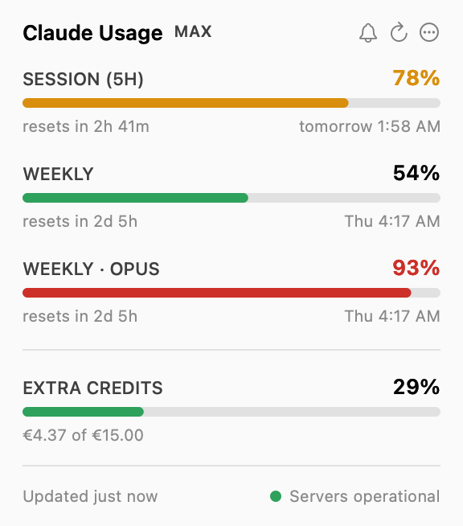
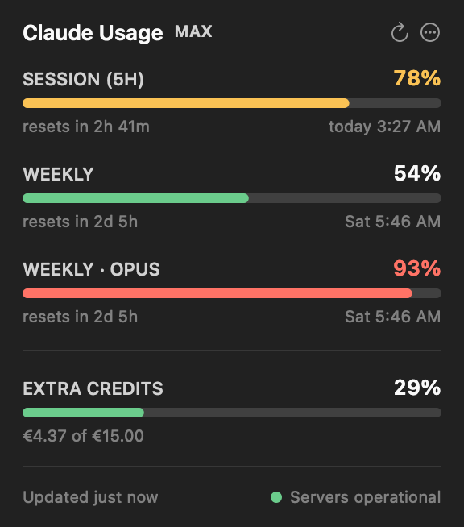
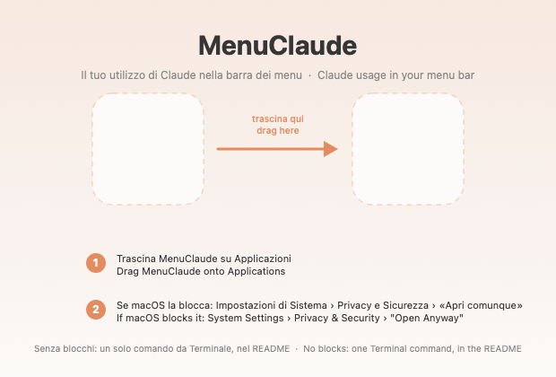

<div align="center">



# MenuClaude

**Your Claude usage, always visible in the macOS menu bar.**

Session percentage, weekly percentage, and a live countdown to the next reset.


[Italiano](README.it.md) · [Download](../../releases/latest)

</div>

---

## What it shows

Click the icon and a panel opens with every quota your plan has — the 5-hour
session, the weekly limit, per-model limits if you have them — plus pay-as-you-go
extra credits and the current status of Claude's servers.

 

The numbers in the bar are configurable. You can also swap them for **three
concentric rings**, Apple Fitness style: the outer ring is the session, the
middle one is how far along the 5-hour window is, the inner one is the week.
They all fill in the same direction — the fuller they are, the less headroom
you have left.

Colours follow the severity the API reports: green below 70%, amber from 70%,
red from 90%.

**English and Italian**, switchable from the menu.

## Requirements

- macOS 11 Big Sur or later (Apple Silicon or Intel)
- [Claude Code](https://claude.com/claude-code) installed, and signed in at
  least once

That's it. No account to create, no configuration file, no dependencies.

## Install

### 1. Download and drag

Grab `MenuClaude.dmg` from the [latest release](../../releases/latest) and open
it. Drag MenuClaude onto the Applications folder.



### 2. First launch: right-click → Open

**This step matters.** MenuClaude is not signed by a registered Apple developer,
so a normal double-click makes macOS refuse to open it — sometimes with a
message suggesting the app is damaged. It isn't.

Open your Applications folder, **right-click MenuClaude, choose Open**, then
confirm in the dialog. You only ever have to do this once; afterwards it opens
normally.

> Why: signing an app so macOS trusts it on first launch requires an Apple
> Developer Program membership (99 USD/year). This is a free tool shared between
> friends, so it isn't signed. The right-click is macOS's built-in way of saying
> "I know where this came from."

### 3. Allow Keychain access — choose "Always Allow"

MenuClaude reads the OAuth token that Claude Code stores in your login Keychain,
because that's what proves to Anthropic which account to report usage for. macOS
will ask permission the first time.

**Choose "Always Allow", not "Allow".** "Allow" grants a single read and the
prompt comes back; "Always Allow" adds the app to the authorised list and you
never see it again.

### 4. Allow notifications (optional)

If you want alerts when you approach your limits, accept the notification
prompt. You can change your mind later from **Alerts** in the menu.

### 5. Launch at login (optional)

Right-click the menu bar icon → **Launch at login**.

The icon lives in the menu bar, top right. It never appears in the Dock.
**Left-click** opens the panel, **right-click** opens the options.

## Where the data comes from

The same numbers you get from `/usage` inside Claude Code. MenuClaude reads the
OAuth token Claude Code stores in the Keychain (item **Claude Code-credentials**)
and calls `api.anthropic.com/api/oauth/usage` directly. Nothing is estimated
from local logs, and there is no server in between.

The token is kept in memory while it is valid, so the Keychain is only read
again when the token expires or gets rejected — not on every update.

Access tokens last a few hours, and **only the `claude` CLI renews them** —
the Claude desktop app keeps its own separate credentials and never touches this
Keychain item. So if you work mostly in the desktop app or on the web, the token
goes stale and MenuClaude will say so; running `claude` in a Terminal once puts
it back on track.

MenuClaude deliberately never renews or writes credentials itself, to avoid
interfering with your Claude Code login.

## Privacy

MenuClaude talks to exactly two addresses: `api.anthropic.com` for usage and
`status.claude.com` for service status. No telemetry, no analytics, no
intermediary server, nothing written outside the app's own preferences. Your
token stays in the Keychain and is only used to sign the request to Anthropic.

## Options

Right-click the menu bar icon:

| Option | What it does |
| --- | --- |
| **What to show** | Session only, session + week, session + timer, everything, ring only, or the three concentric rings |
| **Update frequency** | From 1 to 30 minutes (default: 5) |
| **Alerts** | Which notifications to receive, and at what threshold |
| **Language** | Same as system, Italiano, or English |
| **Show ring** | The circular indicator next to the numbers |
| **Coloured icon** | Turn off to keep the icon monochrome like other system icons |
| **Launch at login** | Installs a LaunchAgent in `~/Library/LaunchAgents` |

The countdown ticks locally every second. The network is only used at the chosen
frequency, when you open the panel with stale data, and after waking from sleep.

**The app slows itself down when nothing is happening.** If two consecutive
checks return identical numbers — overnight, or while you're away — the interval
doubles, up to 30 minutes, and snaps back to normal as soon as something moves.
The usage endpoint is rate-limited and that budget is shared with Claude Code
itself, so idle polling is worth avoiding.

## Alerts

System notifications, each one switchable on its own:

| Alert | When | Default |
| --- | --- | --- |
| Session over threshold | The session passes your chosen threshold | on |
| Week over threshold | The weekly quota passes the threshold | on |
| Limit reached (100%) | A quota is exhausted | on |
| Extra credits over threshold | Pay-as-you-go spend passes the threshold | off |
| Session reset | A new 5-hour window opens | off |
| Claude server status | `status.claude.com` changes — degraded or recovered | off |
| Prolonged update failures | The app hasn't been able to read data for 15+ minutes | off |

One threshold applies to all quotas: 50, 70, 80 (default) or 90%.

Each alert fires **on crossing** the threshold, once. Sitting at 85% does not
produce a notification every minute. The memory resets when the quota resets, so
the alert can fire again in the next window.

If notifications don't arrive, use **Alerts › Send a test notification** — it
tells you whether the problem is the macOS permission.

## Troubleshooting

### The bar shows `!`

```bash
/Applications/MenuClaude.app/Contents/MacOS/MenuClaude --diagnose
```

This prints whether the credentials were found, whether the token is still
valid, and what the API replied.

The most common cause is an **expired token**: open Claude Code once and it
renews itself.

### "Too many API requests"

The usage endpoint is rate-limited, and the budget is shared with Claude Code.
When it refuses, MenuClaude waits before trying again — 2 minutes, then 4, 8,
16, up to 30 — and respects a longer wait if the server asks for one. The panel
shows how long until the next attempt, and keeps showing the last good numbers
in the meantime.

**Pressing Refresh repeatedly doesn't help and used to make it worse**, so the
app now allows one manual retry per waiting period and ignores the rest. The
wait also survives quitting and reopening the app.

### macOS says the app is damaged

It isn't — it's the unsigned-app message. Right-click the app → **Open**. See
[step 2](#2-first-launch-right-click--open).

### Notifications don't arrive

```bash
/Applications/MenuClaude.app/Contents/MacOS/MenuClaude --test-notification
```

If the permission was denied, re-enable it in System Settings › Notifications ›
MenuClaude.

## Build from source

```bash
git clone https://github.com/ileonemil/MenuClaude.git
cd MenuClaude
./build.sh
```

You only need the Xcode Command Line Tools (`xcode-select --install`), not
Xcode itself, and there are no external dependencies — it's plain AppKit,
compiled with `swiftc`. The result is `build/MenuClaude.app`.

To produce the installer:

```bash
./Tools/make-dmg.sh
```

The Keychain authorisation is tied to the signed code's identity. With an
ad-hoc signature that identity is the binary's hash, so **every rebuild brings
the prompt back once**. If you rebuild often, create a personal signing
certificate — Keychain Access → Certificate Assistant → *Create a Certificate*,
type "Code Signing", with a name containing `MenuClaude` — and `build.sh` will
pick it up automatically. Or set `MENUCLAUDE_SIGN_IDENTITY="your identity"`.

## Project layout

```
Sources/MenuClaude/
  main.swift                  entry point and command-line flags
  AppDelegate.swift           menu bar item, timers, context menu
  PopoverViewController.swift the drop-down panel
  Views.swift                 bars, rows and rings, drawn by hand
  Theme.swift                 severity colours, light and dark
  Localization.swift          Italian/English strings
  UsageClient.swift           the usage API call and its parsing
  StatusClient.swift          server status from status.claude.com
  Alerts.swift                when to notify, and delivery
  Backoff.swift               growing wait after a 429
  Models.swift                quotas, credits, date and duration formatting
  Keychain.swift              reading Claude Code's credentials
  Settings.swift              preferences in UserDefaults
  LaunchAtLogin.swift         LaunchAgent
  Diagnostics.swift           --diagnose, --test-notification
  Preview.swift               --preview <folder>
Tools/make-icon.sh            regenerates Resources/AppIcon.icns
Tools/make-dmg.sh             builds build/MenuClaude.dmg
docs/analytics-feasibility.md assessment of an analytics section (not built)
build.sh                      compiles and signs the bundle
```

`--preview <folder>` renders the panel and the menu bar item to PNGs, in light
and dark, without opening the app — handy for checking layout after a change.

## Notes

The API payload changes over time: quotas per model appear and disappear.
MenuClaude reads the `limits` array generically, so a new quota shows up in the
panel without a code change; the older `five_hour` / `seven_day` fields are kept
as a fallback.

The bundle identifier is `com.menuclaude.MenuClaude`. If you publish your own
build, change it in `Info.plist` and `build.sh`.

Released under the [MIT licence](LICENSE). Not affiliated with Anthropic.
