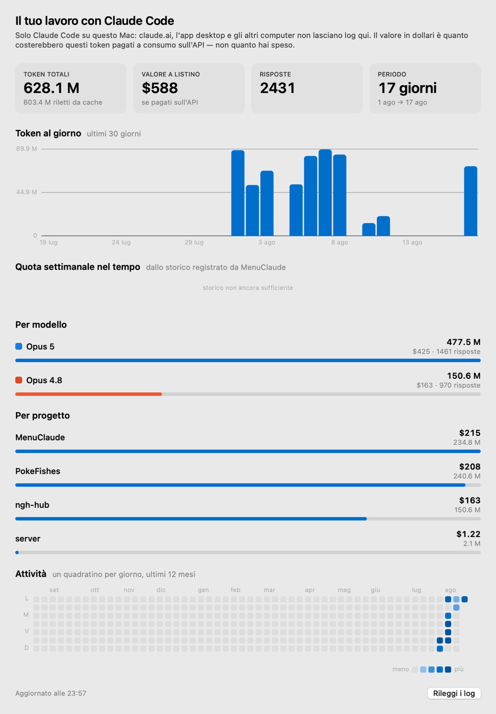

<div align="center">


# MenuClaude

**Your Claude usage, always visible in the macOS menu bar.**

Session percentage, weekly percentage, and a live countdown to the next reset.


[Italiano](README.it.md) · [Download](../../releases/latest)

</div>

---

## What it shows

Click the icon and a panel opens with every quota your plan has — the 5-hour
session, the weekly limit, per-model limits if you have them — plus pay-as-you-go
extra credits and the current status of Claude's servers.

 

The numbers in the bar are configurable. You can also swap them for **three
concentric rings**, Apple Fitness style: the outer ring is the session, the
middle one is how far along the 5-hour window is, the inner one is the week.
They all fill in the same direction — the fuller they are, the less headroom
you have left.

Colours follow the severity the API reports: green below 70%, amber from 70%,
red from 90%.

Under each quota, once there's enough history, MenuClaude adds what it expects
to happen: *at this rate it runs out in 55m*. And **Analytics…** opens a window
with tokens, cost and activity drawn from your Claude Code logs — see
[Analytics](#analytics).

**English and Italian**, switchable from the menu.

## Requirements

- macOS 11 Big Sur or later (Apple Silicon or Intel)
- [Claude Code](https://claude.com/claude-code) installed, and signed in at
  least once

That's it. No account to create, no configuration file, no dependencies.

## Install

### The easy way (recommended)

Paste this into Terminal:

```bash
curl -fsSL https://raw.githubusercontent.com/ileonemil/MenuClaude/main/install.sh | bash
```

It downloads the latest release, puts MenuClaude in `/Applications` and starts
it. **No security warnings to click through** — files fetched with `curl` are
never marked as quarantined, so Gatekeeper has nothing to block. The script is
[right here](install.sh) if you want to read it first; it uses nothing but
tools that ship with macOS.

### The manual way

Download `MenuClaude.dmg` from the [latest release](../../releases/latest),
open it, and drag MenuClaude onto Applications.


Then macOS will refuse to open it, saying it *"cannot verify that MenuClaude is
free of malware"*, offering only **Move to Trash** and **Done**. The app is
fine — it simply isn't signed by a registered Apple developer. To let it
through:

**System Settings → Privacy & Security →** scroll down to Security → next to
*"MenuClaude was blocked…"* click **Open Anyway** → confirm.

> Older guides say to right-click the app and choose Open. **That stopped
> working in macOS 15 Sequoia**: for unsigned apps the shortcut no longer
> appears, and System Settings is the only way through without a Terminal.
> Signing an app so macOS trusts it on sight needs an Apple Developer Program
> membership (99 USD/year), which this free tool doesn't have.

### Then

When macOS asks for Keychain access, choose **"Always Allow"**, not "Allow".
"Allow" grants a single read and the prompt keeps coming back; "Always Allow"
adds the app to the authorised list.

Optionally accept notifications (for the threshold alerts), and turn on
**Launch at login** from the menu.

The icon lives in the menu bar, top right. It never appears in the Dock.
**Left-click** opens the panel, **right-click** opens the options.

Updates from here on are handled by the app itself — see
[Updating](#updating).

## Where the data comes from

The same numbers you get from `/usage` inside Claude Code. MenuClaude reads the
OAuth token Claude Code stores in the Keychain (item **Claude Code-credentials**)
and calls `api.anthropic.com/api/oauth/usage` directly. Nothing is estimated
from local logs, and there is no server in between.

The token is kept in memory while it is valid, so the Keychain is only read
again when the token expires or gets rejected — not on every update.

### The Renew button

Access tokens last a few hours. Only the `claude` **CLI** renews them — the
Claude desktop app keeps its own separate credentials and never touches this
Keychain item. So if you work mostly in the desktop app or on the web, the token
quietly goes stale and MenuClaude stops updating.

When that happens the panel says **Token expired** and offers a **Renew**
button. It uses the refresh token already in your Keychain, against the same
endpoint and client id the CLI uses, and writes the result straight back — the
rest of the Keychain entry, including the MCP server credentials Claude Code
keeps alongside, is preserved untouched.

**This now happens by itself.** When a request comes back saying the token is
expired — the usual case after the Mac has been asleep for hours — MenuClaude
renews it and retries, without you touching anything. It tries once and then
waits five minutes before trying again, so a renewal that doesn't help can't
turn into a stream of requests. Turn it off with **Renew the token
automatically** in the menu.

The **Renew** button and the menu's `Renew the token` are still there for when
you want to force it, and from a Terminal:

```bash
/Applications/MenuClaude.app/Contents/MacOS/MenuClaude --renew-token
```

One thing worth knowing: the server *rotates* the refresh token — a renewal
invalidates the previous one — so if the new token could not be written back,
Claude Code's stored copy would be dead. MenuClaude retries the write, and if it
still fails it says so with a warning pointing at `claude auth login`, rather
than failing quietly.

## The session alarm

The bell in the panel sets an alarm for the moment your 5-hour session resets —
click it again to cancel. It's also in the menu, which shows how long that is.

It is MenuClaude's own alarm rather than a Clock.app timer, because the Clock
app can't be driven from outside: it has no AppleScript dictionary, and its
`clock-timer:` URL scheme only opens the Timer tab without accepting a duration.
What you get is the same in practice — a notification at the exact moment,
delivered even if MenuClaude has been quit in the meantime and even if the Mac
slept through it.

## Updating

MenuClaude updates itself. It checks GitHub releases on launch and once a day;
when a new version exists, the menu's first entry becomes **Update to
MenuClaude x.y.z** and (if the alert is on) a notification arrives. There is
also **Check for updates…** whenever you want.

Installing downloads the DMG from this repository, checks its SHA-256 against
the `.sha256` file published beside it, verifies the app inside matches the
advertised version, then quits, swaps the bundle and reopens — about ten
seconds, no dragging. A checksum that doesn't match aborts the update; a
release that predates the checksum file still installs, since refusing it would
strand exactly the people running the oldest version.

No Apple Developer account is needed: that would be required to *sign* the app,
not to replace it. `/Applications` is writable by admin users. Note that the
update removes the quarantine flag from the freshly downloaded copy, which is
what stops macOS from demanding the right-click-Open dance on every update; it
comes over HTTPS from this repository's own releases and its version is checked
before anything is replaced. If MenuClaude is somewhere it cannot write, it
says so and asks you to move it to Applications.

### How often macOS asks for the Keychain

The authorisation is tied to the *identity of the signed binary*. With an ad-hoc
signature that identity is the binary's hash, so every new build is a stranger:
you get the prompt once on first install and once more after each self-update.
Choosing "Always Allow" each time is all it takes.

To make the grant permanent across updates, sign your builds with a personal
certificate — see [Build from source](#build-from-source).

Note also that reading the entry from a Terminal (`security find-generic-password`)
prompts separately, as `security` is a different program.

## Privacy

MenuClaude talks to exactly two addresses: `api.anthropic.com` for usage and
`status.claude.com` for service status — plus `api.github.com` when it checks
for a new version. The analytics window reads your Claude Code logs from disk
and never sends them anywhere. No telemetry, no analytics, no
intermediary server, nothing written outside the app's own preferences. Your
token stays in the Keychain and is only used to sign the request to Anthropic.

## Settings

Right-click the menu bar icon and choose **Settings…** (or press `⌘,` with the
menu open). Everything lives in one window, on two tabs.

**General**

| Option | What it does |
| --- | --- |
| **In the menu bar** | Session only, session + week, session + timer, everything, ring only, or the three concentric rings |
| **Refresh** | From 1 to 30 minutes (default: 5) |
| **Language** | Same as system, Italiano, or English |
| **Show the progress ring** | The circular indicator next to the numbers |
| **Coloured icon** | Turn off to keep the icon monochrome like other system icons |
| **Renew the token automatically** | Recovers on its own when the token expires (on by default) |
| **Check for updates automatically** | Looks for a new release once a day |
| **Launch MenuClaude at login** | Installs a LaunchAgent in `~/Library/LaunchAgents` |

**Alerts** — one threshold and a switch per notification; see [Alerts](#alerts).

The menu itself keeps only what you act on: refresh, renew the token, the
session alarm, **Analytics…**, **Settings…**, the update, and quit.

The countdown ticks locally every second. The network is only used at the chosen
frequency, when you open the panel with stale data, and after waking from sleep.

**The app slows itself down when nothing is happening.** If two consecutive
checks return identical numbers — overnight, or while you're away — the interval
doubles, up to 30 minutes, and snaps back to normal as soon as something moves.
The usage endpoint is rate-limited and that budget is shared with Claude Code
itself, so idle polling is worth avoiding.

## Analytics

**Analytics…** in the menu opens a window built from the Claude Code logs on
this Mac (`~/.claude/projects`): tokens per day, a breakdown by model and by
project, and a year of activity as a calendar.



Two things to know before reading any number in it, both printed at the top of
the window itself:

- **It only covers Claude Code on this Mac.** claude.ai, the desktop app and
  your other computers leave no logs here, so their work is missing.
- **The dollar figure is not what you paid.** It is what those tokens would
  cost on the pay-as-you-go API at list price — input, output and the three
  cache rates. With a subscription you pay the subscription. Read it as a
  measure of work done, not as a bill.

A model that isn't in the price table is still counted in tokens; its cost is
left out and the window names it rather than inventing a figure.

The scan is incremental — it remembers how far it read into each log file — so
reopening the window costs milliseconds even with months of history.

## Forecasts

Once MenuClaude has watched a quota for half an hour, the panel adds a line
under it: *at this rate it runs out in 55m*, or *at this rate you'll reach the
reset at 74%*. The rate is measured only inside the current window, because
samples from before a reset belong to a quota that no longer exists.

With less than half an hour of samples, or when consumption is flat, the line
stays away instead of guessing.

This is also why MenuClaude keeps a small history of its own readings in
`~/Library/Application Support/MenuClaude/usage-history.jsonl` — the API only
ever reports the present moment, so an hour that isn't recorded is lost.

## Shortcuts and scripting

macOS Clock cannot be driven by another app: it has no AppleScript dictionary
and its `clock-timer:` URL scheme takes no duration. So MenuClaude gives you the
number and lets Shortcuts do the rest:

```bash
/Applications/MenuClaude.app/Contents/MacOS/MenuClaude --json
```

```json
{
  "plan": "pro",
  "session_percent": 47,
  "session_resets_at": "2026-08-18T02:09:59Z",
  "session_resets_in_minutes": 256,
  "weekly_percent": 25,
  "weekly_resets_in_minutes": 5646
}
```

Feed `session_resets_in_minutes` to a **Start Timer** action and you have a real
Clock timer for the reset. On failure the command prints `{"error": "..."}` with
a stable code (`rate_limited`, `token_expired`, …) and exits non-zero.

The running app also answers URLs, which is what a Shortcut or a hotkey app
should use — it doesn't start a second copy:

| URL | Effect |
| --- | --- |
| `menuclaude://open` | Opens the panel |
| `menuclaude://refresh` | Refreshes now |
| `menuclaude://renew` | Renews the token |
| `menuclaude://analytics` | Opens the analytics window |
| `menuclaude://settings` | Opens settings |
| `menuclaude://alarm` | Toggles the session alarm |

## Alerts

System notifications, each one switchable on its own:

| Alert | When | Default |
| --- | --- | --- |
| Session over threshold | The session passes your chosen threshold | on |
| Week over threshold | The weekly quota passes the threshold | on |
| Limit reached (100%) | A quota is exhausted | on |
| Extra credits over threshold | Pay-as-you-go spend passes the threshold | off |
| Session reset | A new 5-hour window opens | off |
| Claude server status | `status.claude.com` changes — degraded or recovered | off |
| Prolonged update failures | The app hasn't been able to read data for 15+ minutes | off |
| New MenuClaude version | A newer release is published on GitHub | on |

One threshold applies to all quotas: 50, 70, 80 (default) or 90%.

Each alert fires **on crossing** the threshold, once. Sitting at 85% does not
produce a notification every minute. The memory resets when the quota resets, so
the alert can fire again in the next window.

If notifications don't arrive, use **Alerts › Send a test notification** — it
tells you whether the problem is the macOS permission.

## Troubleshooting

### The bar shows `!`

```bash
/Applications/MenuClaude.app/Contents/MacOS/MenuClaude --diagnose
```

This prints whether the credentials were found, whether the token is still
valid, and what the API replied.

The most common cause is an **expired token**: press **Renew** in the panel.

### "Too many API requests"

The usage endpoint is rate-limited, and the budget is shared with Claude Code.
When it refuses, MenuClaude waits before trying again — 2 minutes, then 4, 8,
16, up to 30 — and respects a longer wait if the server asks for one. The panel
shows how long until the next attempt, and keeps showing the last good numbers
in the meantime.

**Pressing Refresh repeatedly doesn't help and used to make it worse**, so the
app now allows one manual retry per waiting period and ignores the rest. The
wait also survives quitting and reopening the app.

### macOS says it can't verify the app

Expected: it isn't signed by a registered Apple developer. Either use the
[Terminal installer](#the-easy-way-recommended), which avoids the block
entirely, or go to **System Settings → Privacy & Security → Open Anyway**.

Right-clicking and choosing Open no longer works on macOS 15 and later.

### Notifications don't arrive

```bash
/Applications/MenuClaude.app/Contents/MacOS/MenuClaude --test-notification
```

If the permission was denied, re-enable it in System Settings › Notifications ›
MenuClaude.

## Build from source

```bash
git clone https://github.com/ileonemil/MenuClaude.git
cd MenuClaude
./build.sh
```

You only need the Xcode Command Line Tools (`xcode-select --install`), not
Xcode itself, and there are no external dependencies — it's plain AppKit,
compiled with `swiftc`. The result is `build/MenuClaude.app`.

To produce the installer:

```bash
./Tools/make-dmg.sh
```

The Keychain authorisation is tied to the signed code's identity. With an
ad-hoc signature that identity is the binary's hash, so **every rebuild brings
the prompt back once**. If you rebuild often, create a personal signing
certificate — Keychain Access → Certificate Assistant → *Create a Certificate*,
type "Code Signing", with a name containing `MenuClaude` — and `build.sh` will
pick it up automatically. Or set `MENUCLAUDE_SIGN_IDENTITY="your identity"`.

## Project layout

```
Sources/MenuClaude/
  main.swift                  entry point and command-line flags
  AppDelegate.swift           menu bar item, timers, context menu
  PopoverViewController.swift the drop-down panel
  Views.swift                 bars, rows and rings, drawn by hand
  Charts.swift                bar chart, trend, calendar heatmap, stat tiles
  AnalyticsWindow.swift       the analytics window
  SettingsWindow.swift        the settings window
  LocalUsage.swift            incremental scan of the Claude Code logs
  Pricing.swift               the API price list, updated by hand
  UsageHistory.swift          the recorded history of API readings
  Projection.swift            "at this rate it runs out in…"
  Automation.swift            --json and the menuclaude:// URLs
  Theme.swift                 severity colours, light and dark
  Localization.swift          Italian/English strings
  UsageClient.swift           the usage API call and its parsing
  StatusClient.swift          server status from status.claude.com
  Alerts.swift                when to notify, and delivery
  Backoff.swift               growing wait after a 429
  Models.swift                quotas, credits, date and duration formatting
  Keychain.swift              reading Claude Code's credentials
  Settings.swift              preferences in UserDefaults
  LaunchAtLogin.swift         LaunchAgent
  TokenRefresher.swift        renewing the OAuth token, and writing it back
  Updater.swift               in-app update from GitHub releases
  SessionAlarm.swift          the alarm for the session reset
  Diagnostics.swift           --diagnose, --renew-token, --update, --test-notification
  Preview.swift               --preview <folder>, --analytics-shot <prefix>
Tools/make-icon.sh            regenerates Resources/AppIcon.icns
Tools/make-dmg.sh             builds build/MenuClaude.dmg
docs/analytics-feasibility.md the assessment this analytics window came from
build.sh                      compiles and signs the bundle
```

`--preview <folder>` renders the panel and the menu bar item to PNGs, in light
and dark, without opening the app; `--analytics-shot <prefix>` does the same for
the whole analytics window, unrolled. Both are for checking layout after a
change without disturbing the running copy.

## Notes

The API payload changes over time: quotas per model appear and disappear.
MenuClaude reads the `limits` array generically, so a new quota shows up in the
panel without a code change; the older `five_hour` / `seven_day` fields are kept
as a fallback.

**There is no Notification Centre widget, and there can't be one here.** A
WidgetKit extension compiles fine against the Command Line Tools, but macOS
refuses to register an extension whose signature carries no Team ID: with an
ad-hoc signature `pluginkit` never lists it, so the widget would simply never
appear. It needs a paid Apple Developer account to sign with, which is why
MenuClaude stops at the menu bar.

The bundle identifier is `com.menuclaude.MenuClaude`. If you publish your own
build, change it in `Info.plist` and `build.sh`.

Released under the [MIT licence](LICENSE). Not affiliated with Anthropic.
